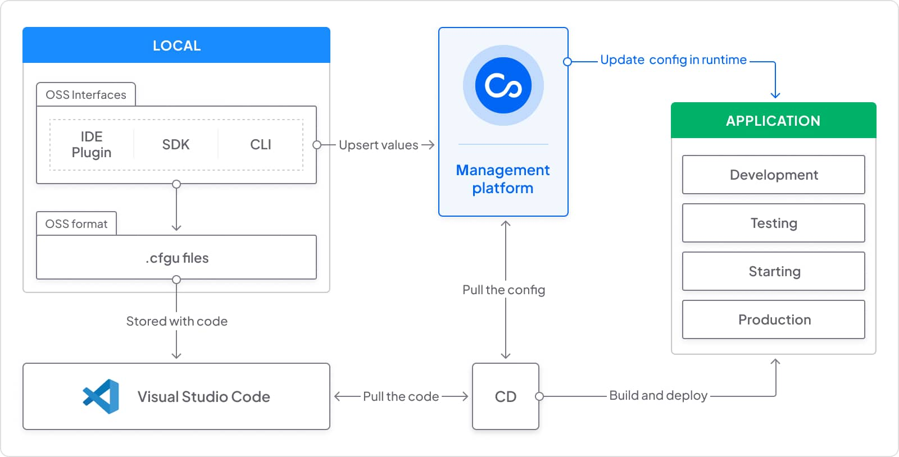

## Architecture

Before using Configu, it's helpful to understand the architecture and examine how Configu works.
Configu is composed of the following components:

- `configu-cli` — A lightweight binary that is available for every major operating system, docker, and CI/CD tools. it wraps all management functionality in a user-friendly CLI.
- `configu-sdk` — The Configu SDK is a library that is configured as a dependency in your application. It allows you to manage your configurations as a code.
- `cfgu files` — The `.cfgu.json` is a human-readable open-source format to declare configurations, represented as code and safe to be stored on your source control alongside with the code.
- `configu-management (Web UI)` — The Configu web interface creates a one-stop-shop for all the configuration needs and manages everything from development to production
  by providing advanced capabilities such as automation, visualization, testing, security, and tracking.
- `ide plugin` — Your IDE is the best place to catch and fix coding issues, Configu's plugin provides immediate feedback in your IDE.

The below diagram shows Configu's SaaS Architecture model.

