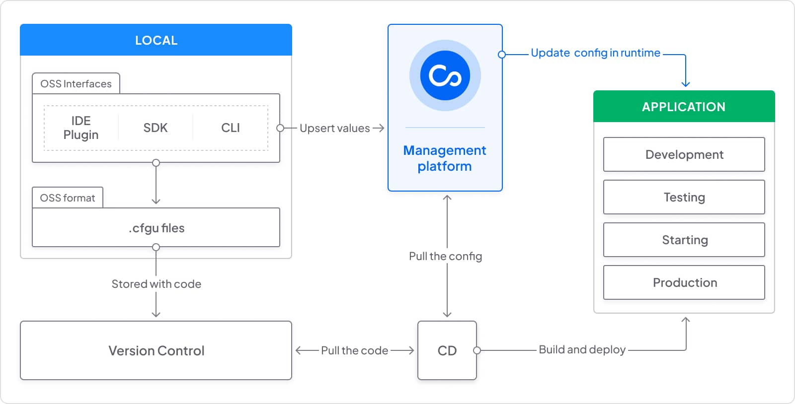

To better understand the architecture and workflow with Configu, it can be helpful to familiarize yourself with the various components that make up the platform. Here is a summary of the main components of Configu:

- `Configu CLI` is a lightweight binary that is available for every major operating system, Docker, and CI/CD tools. It provides a user-friendly interface for managing configurations through the command line.
- `Configu SDK` is a library that can be configured as a dependency in your application. It allows you to manage your configurations as code and provides a simple and consistent way to access configuration data in your application.
- `ConfigSchema file (<uid>.cfgu.json)` is a human-readable, open-sourced format for declaring configurations and their characteristics. It is designed to be stored in your source control alongside the code that uses these configurations, and is safe to be treated as code.
- `Configu SaaS Store` is a web interface tool that provides a one-stop-shop for all configuration needs, from development to production. It offers advanced capabilities such as automation, visualization, testing, security, and tracking.
- `Configu IDE plugin` is a plugin that integrates stright to the development environment (IDE) and provides immediate feedback on configuration issues.

The below diagram demostrates an high level flow using Configu's OSS components toghther with Configu SaaS Store.

{/* TODO remove before merging */}
## Flags

<DefinitionList>

`-c, --clip` **(boolean)** <Version type='green'>New in v0.31.0</Version>
: Lorem ipsum dolor sit amet, consectetur adipiscing elit. Adipiscing massa sed ultrices sed felis volutpat ac. Congue sit nibh sed ipsum, erat facilisis mauris. Amet, est urna facilisi tempus ut amet. Pharetra orci curabitur faucibus purus in nibh. Dolor, sodales malesuada nec vitae scelerisque leo convallis ac dictumst. Euismod.

`-m, --multiline` **(boolean)**<Version type='blue'>New in v0.31.0</Version>
: Lorem ipsum dolor sit amet, consectetur adipiscing elit. Adipiscing massa sed ultrices sed felis volutpat ac. Congue sit nibh sed ipsum, erat facilisis mauris. Amet, est urna facilisi tempus ut amet. Pharetra orci curabitur faucibus purus in nibh. Dolor, sodales malesuada nec vitae scelerisque leo convallis ac dictumst. Euismod.

`-m, --multiline` **(boolean)**<Version type='pink'>New in v0.31.0</Version>
: Lorem ipsum dolor sit amet, consectetur adipiscing elit. Adipiscing massa sed ultrices sed felis volutpat ac. Congue sit nibh sed ipsum, erat facilisis mauris. Amet, est urna facilisi tempus ut amet. Pharetra orci curabitur faucibus purus in nibh. Dolor, sodales malesuada nec vitae scelerisque leo convallis ac dictumst. Euismod.

[Stress test](/)
: First and **only** definition for both terms with additional markup   Read more: [link](/)

</DefinitionList>

## Flags

<DefinitionList>

**(boolean)**
: Lorem ipsum dolor sit amet, consectetur adipiscing elit. Adipiscing massa sed ultrices sed felis volutpat ac. Congue sit nibh sed ipsum, erat facilisis mauris. Amet, est urna facilisi tempus ut amet. Pharetra orci curabitur faucibus purus in nibh. Dolor, sodales malesuada nec vitae scelerisque leo convallis ac dictumst. Euismod.

**(boolean)**
: Lorem ipsum dolor sit amet, consectetur adipiscing elit. Adipiscing massa sed ultrices sed felis volutpat ac. Congue sit nibh sed ipsum, erat facilisis mauris. Amet, est urna facilisi tempus ut amet. Pharetra orci curabitur faucibus purus in nibh. Dolor, sodales malesuada nec vitae scelerisque leo convallis ac dictumst. Euismod.

**(boolean)**
: Lorem ipsum dolor sit amet, consectetur adipiscing elit. Adipiscing massa sed ultrices sed felis volutpat ac. Congue sit nibh sed ipsum, erat facilisis mauris. Amet, est urna facilisi tempus ut amet. Pharetra orci curabitur faucibus purus in nibh. Dolor, sodales malesuada nec vitae scelerisque leo convallis ac dictumst. Euismod.

</DefinitionList>
