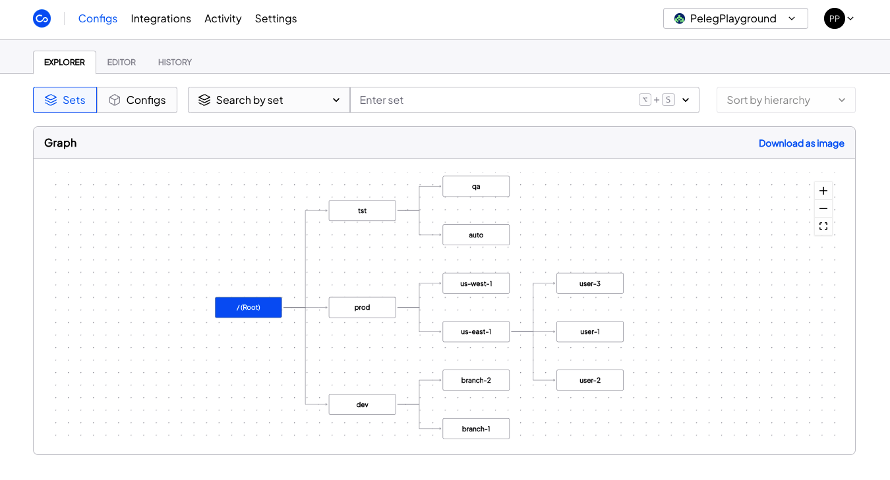

Configu Cloud Platform is the most innovative store dedicated to configurations.
It is built based on the Configu [CaC](/configuration-as-code) model and can modelize the configurations and wrap them with unique layers, providing collaboration capabilities, visibility into configurations workflows, 
and security and compliance standardization abilities.
 
Unlike legacy tools which treat configurations like unstructured data or key-value pairs, Configu is leading the way in Configuration as Code innovation by modeling configurations, 
treating them as first-class citizens in developers' code. This makes our solution more robust and reliable and also enables Configu to provide more capabilities, such as visualization, a testing framework, and security abilities.

With Configu Cloud you can **put an end to your configuration chaos**.

Configu Cloud completing the [Configu Orchestrator](/configu-orcastrator) management by providing the following features:
- [Single Source Of Truth](/configs) - with an easy way to explore and modify the configurations
- **Testing** - beyond the Orchestrator tests, Configu Cloud adds a logic test layer that tests the macro
- [History & Versioning](/configs/#configs-history) - records Config changes and makes it easy to revert if needed
- [Activity Log](/audit-log) - record all actions going through Configu and helps to increase collaboration
- [Webhooks](/webhooks) - enables integration to any 3rd party and push events
- [Permissions](/settings/#organization-members) - invite your team members and control their permissions
- [Tokens](/settings/#organization-tokens) -  enable other tools to integrate into Configu and manage configurations
- **Security** - increase your security and provide compliance standardization abilities

