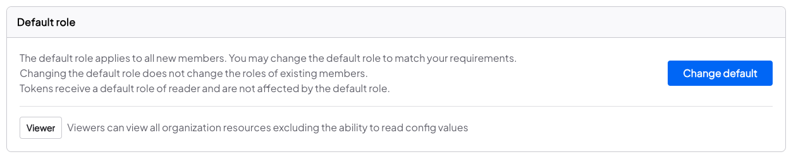
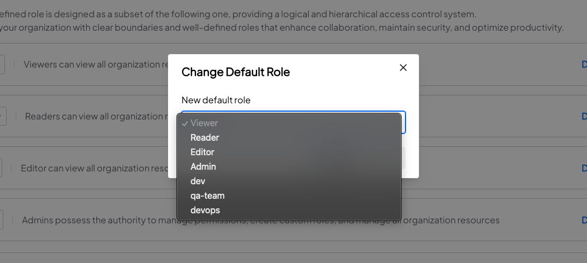
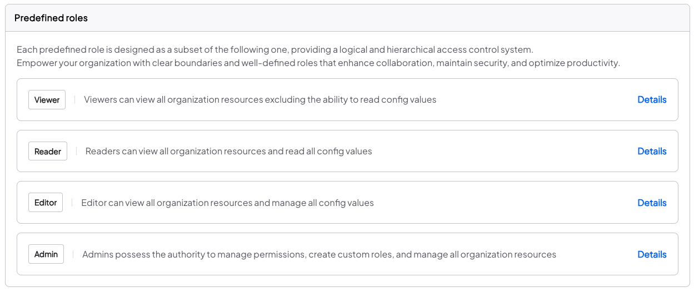
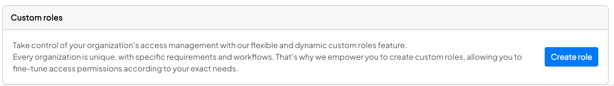
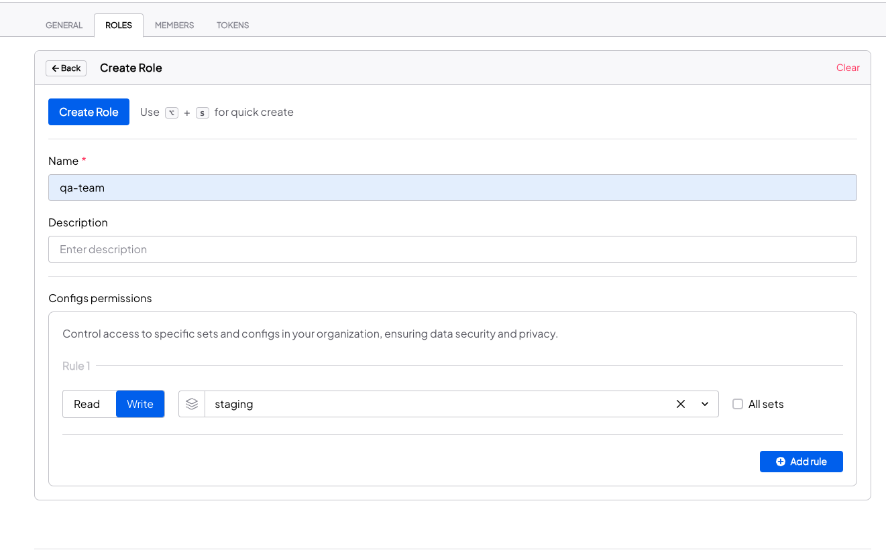
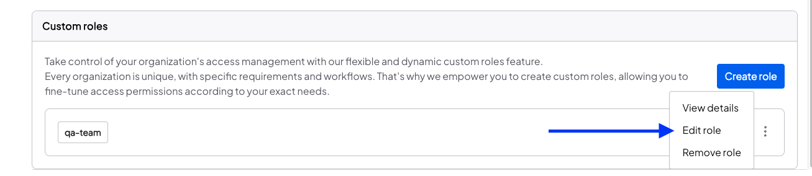
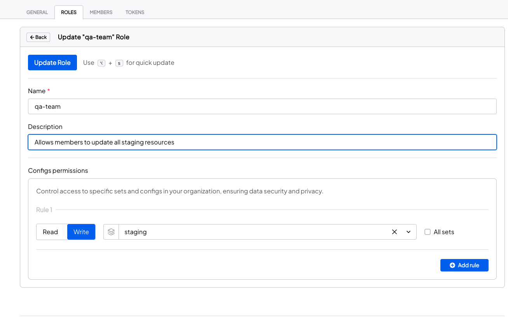
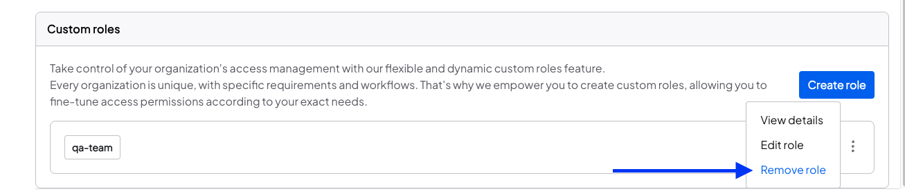

Configu provides role based access control (RBAC) and attribute-based access control (ABAC). Managers (owners and admins) of an organization can assign roles and specific permissions to organization members and tokens according to their requirements.

RBAC and ABAC are inclusive, meaning that the member/token gets access to resources according to the union of all their respective roles and attributes.

## Default role

The default role applies to all new members. You may change the default role to any one of the predefined or custom roles to match your requirements.

<Admonition type="info">

- Changing the default role does not change the roles of existing members.
- Tokens receive a default role of reader and are not affected by the default role.

</Admonition>

## Predefined roles

Each predefined role is designed as a subset of the following one, providing a logical and hierarchical access control system.
Empower your organization with clear boundaries and well-defined roles that enhance collaboration, maintain security, and optimize productivity.

<Admonition type="info">

- Predefined roles are immutable and cannot be changed or deleted.
- The **Admin** role allows management of members, tokens, roles, webhooks, and organization settings.

</Admonition>

## Assign roles

Members and tokens can be assigned a single predefined and any amount of custom roles which give stacking permissions on top of the predefined role permissions. For example:

- User "John Doe" has the "Reader" predefined role and a custom role named "Developer" that has the write permission for the "dev" config set.
- "John Doe" can:
  - Read config values of all config sets due to the "Reader" role.
  - Write config values to the "dev" config set and all its children due to the "Developer" Role

Keep in mind that predefined roles give global config set permissions. If you want to keep config set permissions fine-grained, you should keep your members with the "Viewer" role and tokens with the "Reader" predefined roles and give them custom roles that give them the specific permissions they need.

To assign roles to your [organization members](../members#assign-roles-to-a-member) or [organization tokens](../tokens#assign-roles-to-a-token), go to their respective pages and edit their roles.

## Creating a custom role

Take control of your organization's access management with our flexible and dynamic custom roles feature.
Every organization is unique, with specific requirements and workflows. That's why we empower you to create custom roles, allowing you to fine-tune access permissions according to your exact needs.

1. Go to the **Roles** page under the **Settings** tab
2. Click the **Create Role** button and provide the role name and role permissions.
3. After adding the role, you will see it listed in the custom roles list.

<Admonition type="info">

- The **read** permission grants access to read config values of the selected set and its parent sets.
- The **write** permission grants access to read and edit config values of the selected set and its child sets.
- The **read all** permission grants access to read config values of all sets.
- The **write all** permission grants access to read and edit config values of all sets.

- Duplicate rules are omitted when creating/updating roles.

</Admonition>
<Admonition type="tip">

Rules can be created for config sets that do not yet exist. This is useful for the following cases:

- You want your member or token to have read access to a config set as soon as it's created.
- You want to give your member or token the ability to create a config set.

</Admonition>
<Admonition type="warning">

Role names are unique, attempting to use an existing role name including predefined roles will result in an error.

</Admonition>

## Updating a custom role

## Deleting a custom role

<Admonition type="caution">

- The deleted role will be unassigned from any member or token that used it.
- Custom roles that have been selected as the default role cannot be deleted.

</Admonition>
