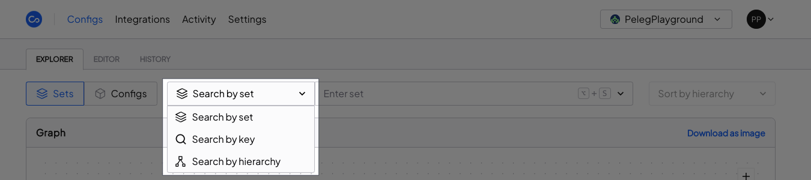
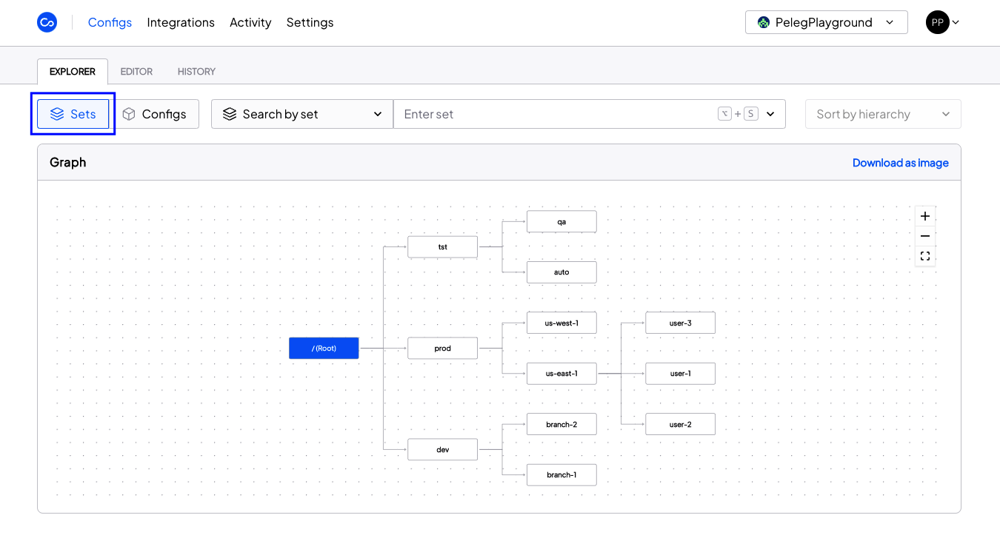
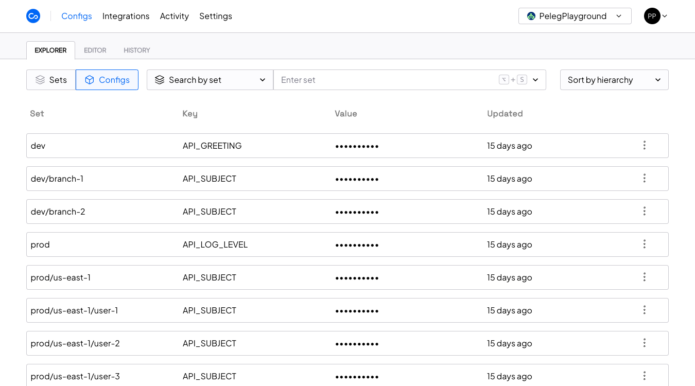
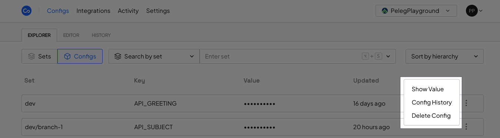

Let's understand how Configu structures and visualize configurations.
The Configs pages are where you can view and manage your configurations.

The Config Explorer is a dashboard page that shows all the configuration data with a simple visualization.
You organize and view the data in **Sets** (e.g., environments, regions, branches, customers). You can view the details of a configuration in the **Configs** view.

You can also search and filter the data by:

- Set - set name or part of it
- Key - key name or part of it
- Hierarchy - set and all its children

## Sets View

The Sets view is the default view, and it shows all your [ConfigSets](/config-set) on a graph with the relationship between them.

## Configs View

The Configs view shows all the configs data you have permission for (e.g., set name, key, value, last update).
Admin can mask the values for security reasons.

You can show masked values, see the history of the config, or delete it (if you have permission).

