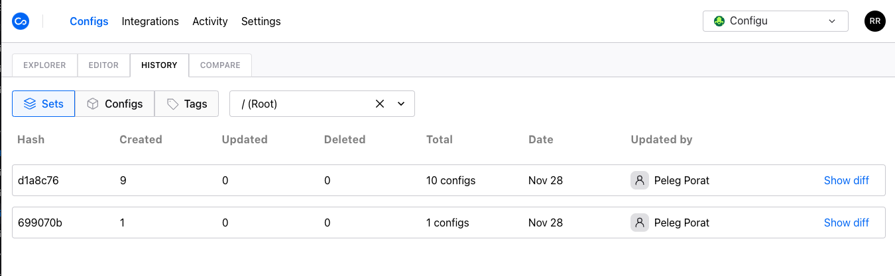

Configu has a robust [logging](/audit-log) and versioning system.
Similar to how source controls like git work, every action is recorded, viewable and can be reverted if necessary.

The history log is available for three entities:

- Set - allows you to see the history of the entire Set with every change
- Config - allows you to see the history of a specific config (key & set)
- Version - allows you to set a snapshot as a version and then jump between versions (coming soon)

### Rollbacks

For every history log entry, you will see a _Revert Changes_ button inside the diff window.

