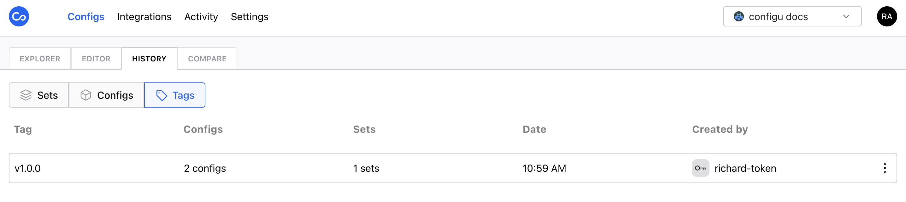

Configu has a robust [logging](/audit-log) and versioning system.
Similar to how source controls like git work, every action is recorded, viewable and can be reverted if necessary.

The history log is available for three entities:

- Set - allows you to see the history of the entire Set with every change
- Config - allows you to see the history of a specific config (key & set)
- Version Tag - allows you to set a snapshot as a version and then jump between versions


### Version Tags
Tags are a way to mark a specific snapshot of the organization's configs as a version.
Once a tag is created, you can compare it with the current state of your organization and revert to it.
**Tags can be created, viewed, and reverted only by the organization's admins.**

<Admonition type="caution">
  Tags can only be created and applied to the entire organization, not to a specific set or config.
</Admonition>

#### Create a tag
In order to create a tag you'll first need to create a token with the `Admin` role.
See [Tokens](/tokens/#assign-roles-to-a-token) for more information about creating tokens and assigning them roles.

Once your token is ready, you can create a tag with the following request to our API:

```shell
curl --request POST \
  --url https://api.configu.com/config/tag/revision \
  --header 'Content-Type: application/json' \
  --header 'Org: YOUR_ORG_ID' \
  --header 'Token: YOUR_TOKEN' \
  --data '{
	"tag": "V0.0.0"
}'
````
<Admonition type="warning">
  Tag can be any alphanumeric string. optionally with the following characters: `. _ / -`
</Admonition>
<Admonition type="tip">
  Your organization ID can be found under [organization settings](/settings)
</Admonition>

If everything went well, you should get a response with status `200` and your tag is ready to use.
You can now view it in the history log and revert to it if necessary.



### Rollbacks

For every history log entry, you will see a _Revert Changes_ button inside the diff window.


