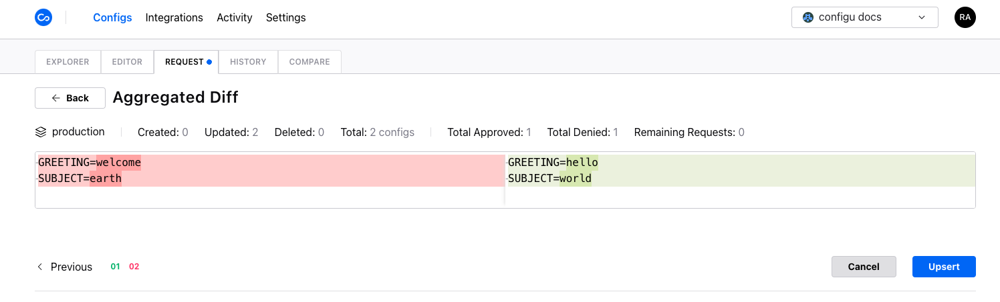

The Configs Request tab displays all the [protected sets](../settings#protected-sets) and indicates any pending change requests made by members of the organization.

Admins of the organization can view the pending requests for each protected set and begin a review process to approve or reject each request. As the reviewer approves change requests, the differences between the current and requested values are updated based on their actions but commits only upon reaching the summary stage.

After reviewing all the requests, the reviewer will displayed a summary view to review all the approved changes in bulk while also being shown the accumulation of all the approved requests. At any point after the first request, the reviewer may click `aggregated diff` to reach the same summary view.

Clicking `upsert` will be resolve change requests according to the reviewer's selection and all configs of approved changes are upserted simultaneously.
