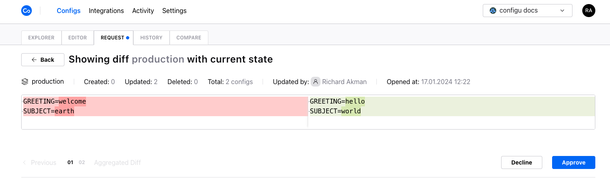

The Configs Request tab displays all the [protected sets](../settings#protected-sets) and indicates any pending change requests made by members of the organization.

Admins of the organization can view the pending requests for each protected set and begin a review process to approve or reject each request. As the reviewer approves change requests, the differences between the current and requested values are updated based on their actions but commits only upon reaching the summary stage.

<Admonition type="info">

- The changes aren't committed until the reviewer reaches the summary stage and clicks `upsert`.
- You can return to previous change requests by clicking the `previous` button. This action resets the decision in the previous request.
- The `REQUEST` tab is highlighted with a blue dot indicator when there is at least one pending request.

</Admonition>

## Summary stage - Aggregated Diff

At any point after the first request, the reviewer may click `aggregated diff` to reach a summary view to review all the approved changes in bulk while also being shown the accumulation of all the approved requests. This happens automatically if upon resolving the final request

Clicking `upsert` will be resolve change requests according to the reviewer's selection and all configs of approved changes are upserted simultaneously.

Upserts resulting from approval of change request create `Upsert Config` [audits](../audit-log). These audits reflect details regarding the original upsert request made by the user who triggered the request along with details regarding the user who approved the request.

