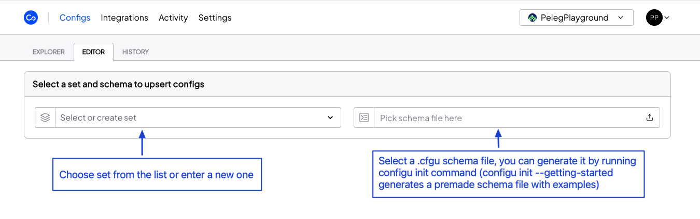
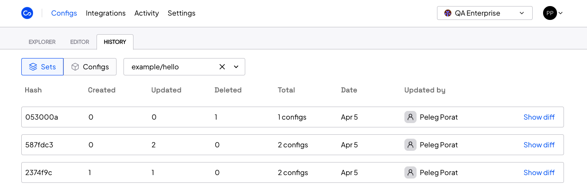

Let's understand how Configu structures and visualize configurations.
The Configs pages are where you can view and manage your configurations.

## Configs Explorer (Dashboard)
The Config Explorer is a dashboard page that shows all the configuration data with a simple visualization.
You organize and view the data in **Sets** (e.g., environments, regions, branches, customers). You can view the details of a configuration in the **Configs** view.

You can also search and filter the data by:
 - Set - set name or part of it
 - Key - key name or part of it
 - Hierarchy - set and all its children

### Sets View
The Sets view is the default view, and it shows all your [ConfigSets](/config-set) on a graph with the relationship between them.

### Configs View
The Configs view shows all the configs data you have permission for (e.g., set name, key, value, last update).
Admin can mask the values for security reasons.

You can show masked values, see the history of the config, or delete it (if you have permission).

## Configs Editor
The Configs Editor is where you can upsert (create/edit/delete) configs to an existing set or create a new one.
As in the other interfaces (CLI & SDKs), you need to insert the set name (choose an existing one or create a new one) and upload the updated schema file `.cfgu.json`.

## Configs History

Configu has a robust [logging](/audit-log) and versioning system.
Similar to how source controls like git work, every action is recorded, viewable and can be reverted if necessary.

The history log is available for three entities:

- Set - allows you to see the history of the entire Set with every change
- Config - allows you to see the history of a specific config (key & set)
- Version - allows you to set a snapshot as a version and then jump between versions (coming soon)

### Rollbacks

For every history log entry, you will see a *Revert Changes* button inside the diff window.

