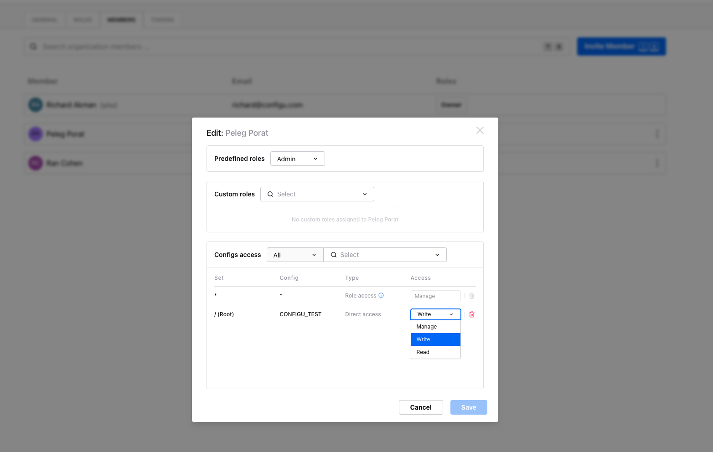

## Adding Users

Users can be added to Configu using the following methods:

- Send Invite
- SAML Single Sign-On

New members are assigned the [default role](../authorization#default-role) from the organization settings.

## Send Invite

Users can be manually invited to join an organization from the member's page. The account must be able to receive mail.

## SAML Single Sign-On

Configu supports SAML Single Sign-On for managing organization access and authentication using your Single Sign-On provider.
For more information about SAML support please contact us at info@configu.com.

## Manage member permissions

### Assign roles to a Member

Organization members can be given roles that define what resources they can access. Read more about [role assignment](../authorization#assign-roles) in the authorization page.

### Assign config access to a Member

A member's individual config permissions can be edited and deleted through the config access section. Read more about how to [assign config attributes](../authorization#assign-config-attribute) in the authorization page.

## Removing a Member

