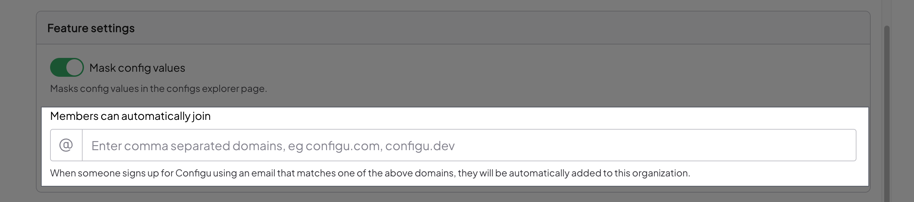

## Organization Settings

 You can manage your organization in your organization settings.

### Organization Information

Here you can find your organization information, including org and owner.

### Feature Settings

- **Config Masking** - While Configu secures every value it receives, masked visibility helps increase security. When the Config Masking feature is on (by default), values are not displayed in the dashboard until the user intentionally reveals the value.
    - Unmasked - Always displayed - Does not require intention to reveal
    - Masked - Masked (___****___) - The value can be revealed by clicking the Show Config button

- **Domain Verification** - For increased security, we recommend that owners verify a domain via the Settings page so email accounts belonging to that domain can be added automatically to that organization.

### Organization Plan

Note: Configu Orchestrator is open-source and free forever. 
For the Configu Cloud, we offer a generous free plan and we expect that many developers and teams will fall within this plan's limits.
In this section, you can track how much you use and upgrade if needed.

### Danger Zone

The danger zone will be visible only to the organization owner.

## Organization Members

### Adding Users
Users can be added to Configu using the following methods:
- Send Invite
- SAML Single Sign-On

### Send Invite
Users can be manually invited to join an organization from the member's page. The account must be able to receive mail.

### SAML Single Sign-On
Configu supports SAML Single Sign-On for managing organization access and authentication using your Single Sign-On provider.
For more information about SAML support please contact us at info@configu.com.

## Organization Tokens
Provide restricted Configs access to an application.

A Configu Token is useful for:
- Authenticating the Configu CLI from a non-interactive system (e.g., CI/CD, Docker)
- Authenticating in real-time using one of our SDKs

To generate a token, head over to the Token page in the Settings tab.

 

