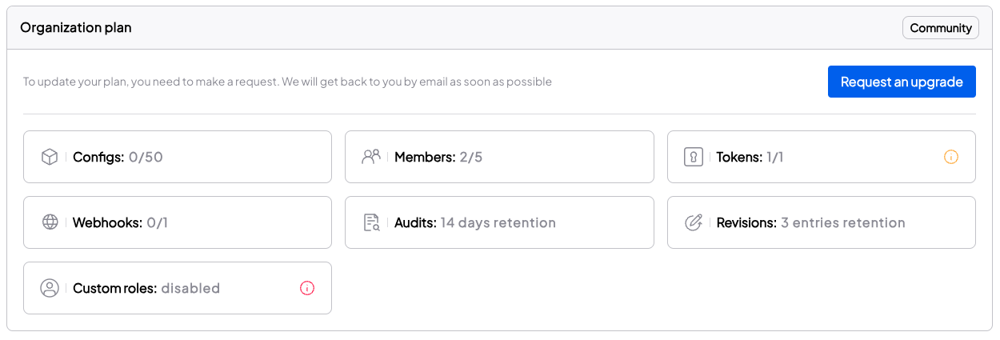

## Organization Settings

 You can manage your organization in your organization settings.

### Organization Informations
Here you can find the organization information, from the org name to who is the owner.

### Feature settings
- **Config Masking** - While we secure every value we receive, masked visibility helps teams to increase their security. When the Config Masking feature is on (by default), values are not displayed in the dashboard until the user explicitly reveals them.
    
    - Unmasked - Always displayed - does not require the user to explicitly reveal
    - Masked - Masked (___****___), Value can be revealed by clicking the Show Config button
        

- **Domain Verification** - For increased security, we recommend Owners verify a domain via the Settings page so email accounts belonging to that domain can be added automatically to this organization.

### Organization Plan

<Admonition>
Configu orchestrator is an open-source and free forever
We have a free tier and we expect most developers and teams to fall within this tier limits.
In this section, you can track how much you use and upgrade if needed.
</Admonition>

 

### Danger Zone

The danger zone will be visible only to the organization owner.

## Organization Members

### Adding Users
Users can be added to Configu using the following methods:
- Send Invite
- SAML Single Sign-On

### Send Invite
Users can be manually invited to join an organization from the member's page. The account must be able to receive mail.

### SAML Single Sign-On
Configu supports SAML Single Sign-On for managing organization access and authentication using your Single Sign-On provider.
For more information about SAML support please contact us at info@configu.com.

## Organization Tokens
Provide restricted Configs access to an application.

A Configu Token is useful for:
- Authenticating the Configu CLI from a non-interactive system (e.g. CI/CD, Docker)
- Authenticating in real-time using one of our SDKs

To generate a token, head over to the Token page in the settings tab.

