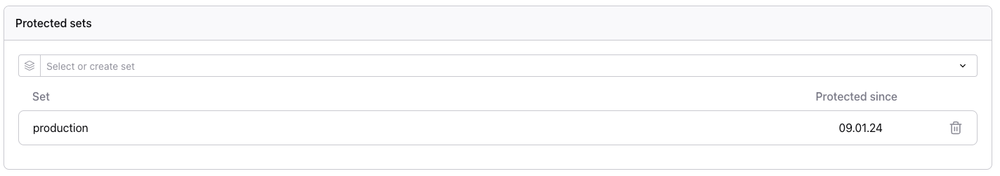
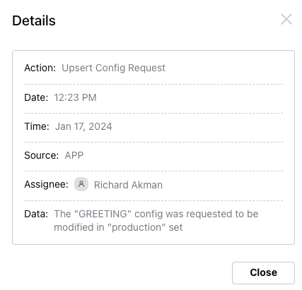
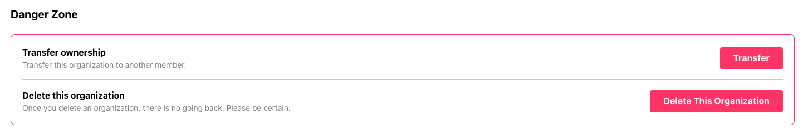
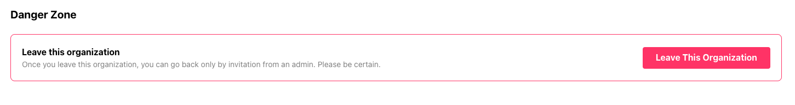

You can manage your organization in your organization settings.

## Organization Information

Here you can find your organization information, including org and owner.

## Feature Settings

- **Domain Verification** - For increased security, we recommend that owners verify a domain via the Settings page so email accounts belonging to that domain can be added automatically to that organization.

## Protected Sets

For stricter access control, owners can define protected sets via the Settings page. Any mutation of protected sets within the organization will trigger change requests that are [queued for approval by an admin](../approval-queue).

<Admonition type="tip">

Config sets that do not yet exist can also be protected.

</Admonition>

Mutations of protected sets create a `Upsert Config Request` [audit](../audit-log) entry.

## Organization Plan

<Admonition>
  Configu Orchestrator is open-source and free forever. For the Configu Cloud, we offer a generous
  free plan and we expect that many developers and teams will fall within this plan's limits. In
  this section, you can track how much you use and upgrade if needed.
</Admonition>

 

## Danger Zone

The following will be visible only to the organization owner.

- **Transfer Ownership** - Gives another member the owner role which has permissions for all organization resources. The previous owner is assigned the [default role](../authorization#default-role).
- **Delete this organization** - Permanently deletes the organization and its resources.

The following will be visible all other organization members.

- **Leave this organization** - Removes you from the organization. You can only rejoin if reinvited.
