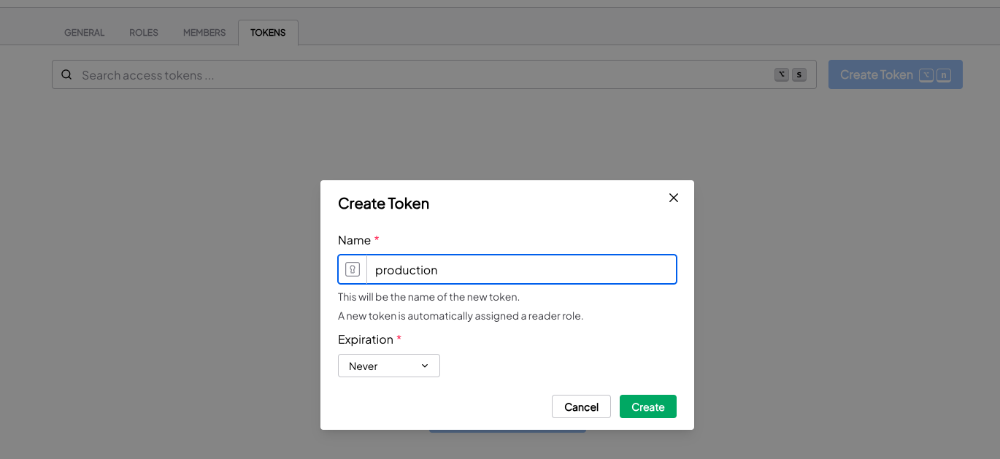
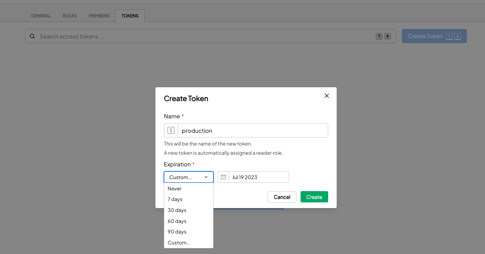
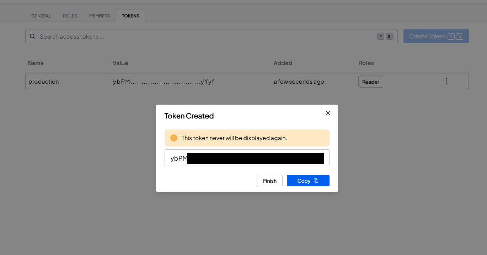
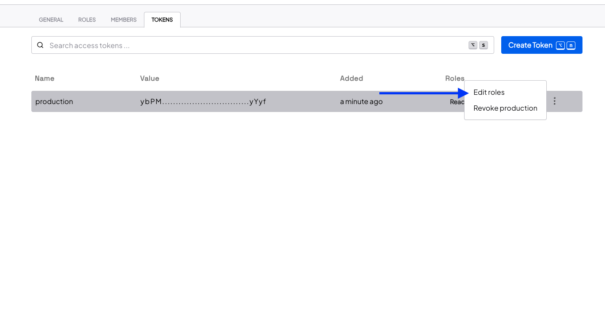
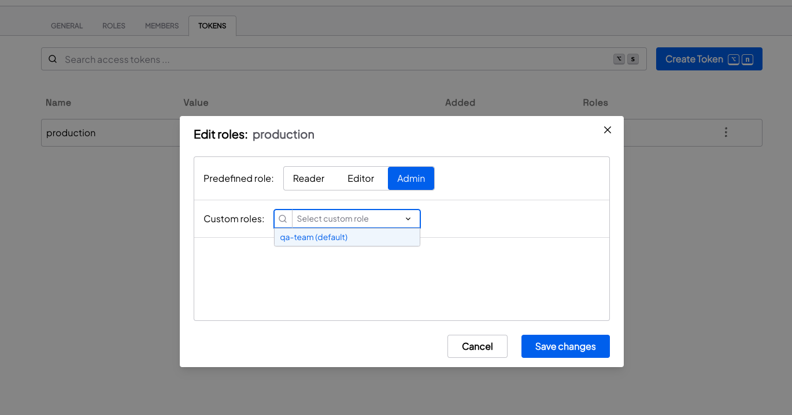
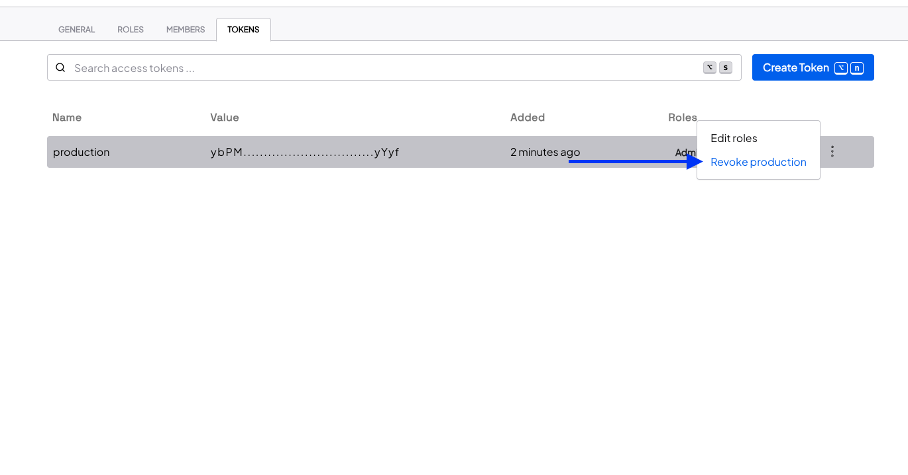

Provide restricted Configs access to an application.

A Configu Token is useful for:

- Authenticating the Configu CLI from a non-interactive system (e.g., CI/CD, Docker)
- Authenticating in real-time using one of our SDKs

## Creating a Token

To generate a token, head over to the Token page in the Settings tab.
New tokens are assigned [the reader role](../authorization#predefined-roles).

<Admonition type="info">

A token can optionally be given an expiration date.

</Admonition>

<Admonition type="warning">

Safely store the token value. You won't be able to see it again!

</Admonition>

## Assign roles to a Token

Organization tokens can be given roles that define what resources they can access. Read more about [role assignment](../authorization#assign-roles) in the authorization page.

<Admonition type="info">

- Tokens cannot be assigned the viewer role.

</Admonition>

## Revoking a Token

In case a token is no longer necessary, you may prematurely revoke a token at any time.

