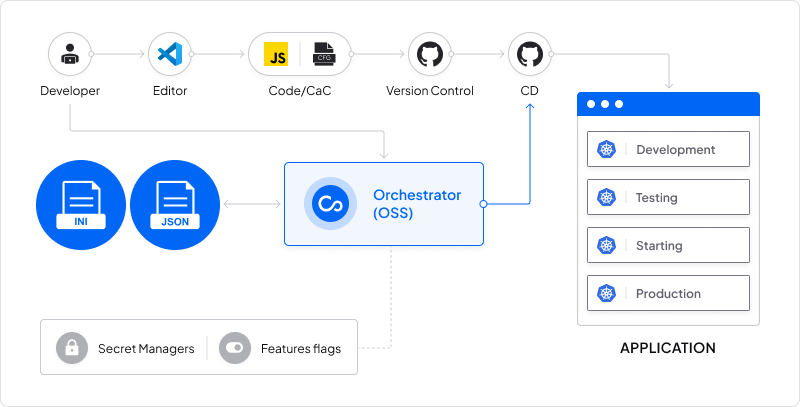

Today's dev teams are tasked with managing Config Ops on the _platform_ as well,
Configu lets you only worry about your application [schemas](/config-schema), with Configu providing the rest of what's needed, including managing the diffrent storage platforms
and validating your new config values. Check out the tutorial below that shows how to use [Configu Orchestrator (open-source)](https://github.com/configu/configu) to manage
[JSON files](https://json.org) and [INI files](https://en.wikipedia.org/wiki/INI_file).



To complete the tutorial, you'll need:

- A [JSON file](https://docs.aws.amazon.com/secretsmanager/latest/userguide/intro.html) or an [INI file](https://en.wikipedia.org/wiki/INI_file)
- [Configu's CLI](/cli-setup)
- [hackathon-starter application](https://github.com/sahat/hackathon-starter)

<Admonition type="info">
- Make sure that the files are already created when using the Configu CLI.
- When using a JSON file, make sure it is a root-level array.

</Admonition>

As most applications already have configuration files, In this example, we will use the `.env.example` file from the hackathon-starter repo:

`.env.example`

```bash
BASE_URL=http://localhost:8080
MONGODB_URI=mongodb://localhost:27017/test
SITE_CONTACT_EMAIL=youremail@yourdomain.com

...

```

## Step 1 - Create schema declaration

Instead of maintaining a `.env` file for each environment or duplicating the keys,
create a `.cfgu` schema declaration for this service, so that each change will only have to be made once (only the key in the schema) and then the values will be initialized by the same interface.
We will use the `init` command to generate it and for this example, we can also use the `--import` flag to auto-generate it from the existing `.env` file:

```bash
configu init --import .env.example --defaults --types --name app
```

<Admonition type="info">
  `--types` will automatically generate the types for you, based on the supported types. If you use
  this flag, always check and verify that the generated types are accurate
</Admonition>

`app.cfgu.json`

```json
{
  "BASE_URL": {
    "type": "URL",
    "default": "http://localhost:8080"
  },
  "MONGODB_URI": {
    "type": "String",
    "default": "mongodb://localhost:27017/test"
  },
  "SITE_CONTACT_EMAIL": {
    "type": "Email",
    "default": "youremail@yourdomain.com"
  },

  ...
}
```

<Admonition type="info">
  Although saving configurations in the source control is considered to be bad practice, the Cfgu
  format is designed to be part of the code as it doesn't include any sensitive values. Doing that
  increases developers' velocity and helps them avoid leaving the terminal/IDE.
</Admonition>

## Step 2 - Use defaults for local development

<Admonition type="info">
  For the full instructions please follow the `hackathon-starter` [getting started
  guide](https://github.com/sahat/hackathon-starter/blob/master/README.md#getting-started)
</Admonition>

Running a local environment was never easier, run Configu seamlessly with your app.

```bash
configu eval --schema "./app.cfgu.json" | configu export --run "node app.js"
```

## Step 3 - Manage configs in JSON/INI files using Configu Orchestrator

Using a single set of commands we can control any store from local files to secret managers.
In the following example, we will manage our configs over our JSON/INI files.

### Using JSON/INI files

Configu's CLI needs to be directed to your desired file by providing a file path via the [.configu file](../cli-config).

example:

<CodeTabs labels={["JSON File", "INI File"]}>

```json
{
  "stores": {
    "file-store": {
      "type": "json-file",
      "configuration": {
        "path": "path/to/file.json"
      }
    }
  }
}
```

```json
{
  "stores": {
    "file-store": {
      "type": "ini-file",
      "configuration": {
        "path": "path/to/file.ini"
      }
    }
  }
}
```

</CodeTabs>

### Upsert values

```bash
configu upsert --store "file-store" --set "prod" --schema "./app.cfgu.json" \
    -c "BASE_URL=http://app.yourdomain.com" \
    -c "SITE_CONTACT_EMAIL=info@yourdomain.com"
```

We can also easily add configs to additional environments like `test`

```bash
configu upsert --store "file-store" --set "test" --schema "./app.cfgu.json" \
    -c "BASE_URL=http://app.test.yourdomain.com" -c "SITE_CONTACT_EMAIL=test@yourdomain.com"
```

### Export values

Similar to the way we previously used the Cfgu defaults we can evaluate and export from any store we need.

```bash
configu eval --store "file-store" --set "prod" --schema "./app.cfgu.json" \
 | configu export --run "node app.js"
```

You're done! This was a simple operation, but that's the best way to show someone the power and the simplicity of Configu Orchestrator and how you can use it to manage your configuration automatically and safely using all your current stores.
