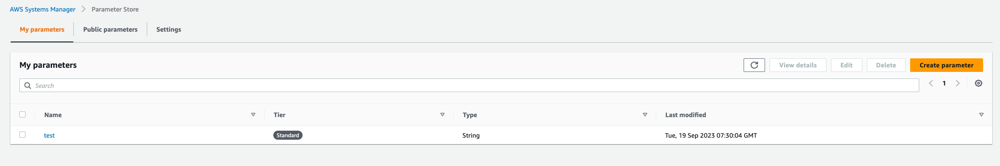

Integrates the Configu Orchestrator with AWS Parameter Store.

## SDK Usage

<CodeTabs labels={["Node SDK", "Python SDK"]}>

```js
import path from 'path';
import {
  AWSParameterStoreConfigStore,
  ConfigSet,
  ConfigSchema,
  UpsertCommand,
  EvalCommand,
  ExportCommand,
  TestCommand,
  DeleteCommand,
} from '@configu/node';

(async () => {
  try {
    const store = new AWSParameterStoreConfigStore({
      credentials: {
        accessKeyId: 'accessKeyId',
        secretAccessKey: 'secretAccessKey',
      },
      region: 'us-east-1',
    });
    const set = new ConfigSet('test');
    const schema = new ConfigSchema(path.join(__dirname, 'get-started.cfgu.json'));

    await new TestCommand({ store, clean: true }).run();

    await new UpsertCommand({
      store,
      set,
      schema,
      configs: {
        GREETING: 'hey',
        SUBJECT: 'configu node.js sdk',
      },
    }).run();

    const data = await new EvalCommand({
      store,
      set,
      schema,
    }).run();

    const configurationData = await new ExportCommand({
      data,
    }).run();

    console.log(configurationData);

    await new DeleteCommand({ store, set, schema }).run();
  } catch (error) {
    console.error(error);
  }
})();
```

```python
coming soon
```

</CodeTabs>

## CLI Usage

Configu's CLI needs to be authorized to access your AWS Parameter Store account. This can be done two ways

- By default, Configu's CLI uses the standard authentication method AWS uses, if your CLI has the right IAM access credentials, there's no special action to take.
- via the [.configu file](../cli-config).

example .configu file:

```json
{
  "stores": {
    "aws-param-store": {
      "type": "aws-parameter-store",
      "configuration": {
        "credentials": {
          "accessKeyId": "accessKeyId",
          "secretAccessKey": "secretAccessKey"
        },
        "region": "us-east-1"
      }
    }
  }
}
```

### Test command

```bash
configu test --store "aws-param-store" --clean
```

### Upsert command

```bash
configu upsert --store "aws-param-store" --set "test" --schema "./get-started.cfgu.json" \
    -c "GREETING=hey" \
    -c "SUBJECT=configu node.js sdk"
```

### Eval and export commands

```bash
configu eval --store "aws-param-store" --set "test" --schema "./get-started.cfgu.json" \
 | configu export
```

Export result:

```json
{
  "GREETING": "hey",
  "SUBJECT": "configu node.js sdk",
  "MESSAGE": "hey, configu node.js sdk!"
}
```

### Delete command

Clean up the previous upsert by using:

```bash
configu delete --store "aws-param-store" --set "test" --schema "./get-started.cfgu.json"
```

## Examples

Secrets list:


Upserted values to the `test` config set:

