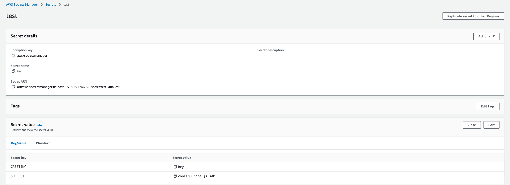
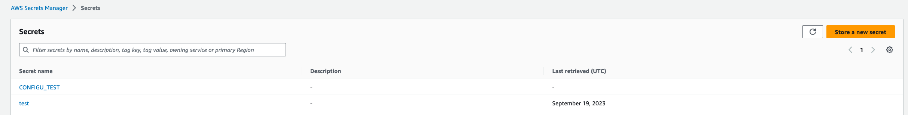

Integrates the Configu Orchestrator with [AWS Secrets Manager](https://docs.aws.amazon.com/secretsmanager).

## Initialization

Configu's needs to be authorized to access your AWS Secrets Manager account. By default, Configu uses the standard authentication methods that the AWS SDKs use, if you have the right IAM access credentials, there's no special action to take. Otherwise, you need to supply the credentials according to the interface that you use:

- [Node.js SDK & CLI configuration options](https://docs.aws.amazon.com/AWSJavaScriptSDK/v3/latest/clients/client-secrets-manager/interfaces/secretsmanagerclientconfig.html)
- [Python SDK configuration options](https://boto3.amazonaws.com/v1/documentation/api/latest/guide/quickstart.html#configuration)

Example [.configu file](../cli-config) file store configuration for CLI usage:

```json
{
  "stores": {
    "aws-secrets-manager-store": {
      "type": "aws-secrets-manager",
      "configuration": {
        "credentials": {
          "accessKeyId": "accessKeyId",
          "secretAccessKey": "secretAccessKey"
        },
        "region": "us-east-1"
      }
    }
  }
}
```

## Limitations

<Admonition type="info">
  - A secret scheduled for deletion cannot be changed by the Configu Orchestrator. You will need to
  manually cancel the secret deletion.
</Admonition>

## SDK Usage

<CodeTabs labels={["Node SDK", "Python SDK","Go SDK"]}>

```js
import path from 'path';
import {
  AWSSecretsManagerConfigStore,
  ConfigSet,
  ConfigSchema,
  UpsertCommand,
  EvalCommand,
  ExportCommand,
  TestCommand,
  DeleteCommand,
} from '@configu/node';

(async () => {
  try {
    const store = new AWSSecretsManagerConfigStore({
      credentials: {
        accessKeyId: 'accessKeyId',
        secretAccessKey: 'secretAccessKey',
      },
      region: 'us-east-1',
    });
    const set = new ConfigSet('test');
    const absolutePath = path.resolve(path.join(__dirname, 'get-started.cfgu.json'));
    const fileContent = await fs.readFile(absolutePath, { encoding: 'utf8' });
    const schemaContents = JSON.parse(fileContent);
    const schema = new ConfigSchema('get-started', schemaContents);

    await new TestCommand({ store, clean: true }).run();

    await new UpsertCommand({
      store,
      set,
      schema,
      configs: {
        GREETING: 'hey',
        SUBJECT: 'configu node.js sdk',
      },
    }).run();

    const data = await new EvalCommand({
      store,
      set,
      schema,
    }).run();

    const configurationData = await new ExportCommand({
      data,
    }).run();

    console.log(configurationData);

    await new DeleteCommand({ store, set, schema }).run();
  } catch (error) {
    console.error(error);
  }
})();
```

```python
coming soon
```

```GO
coming soon
```

</CodeTabs>

## CLI Usage

### Test command

```bash
configu test --store "aws-secrets-manager-store" --clean
```

### Upsert command

```bash
configu upsert --store "aws-secrets-manager-store" --set "test" --schema "./get-started.cfgu.json" \
    -c "GREETING=hey" \
    -c "SUBJECT=configu node.js sdk"
```

### Eval and export commands

```bash
configu eval --store "aws-secrets-manager-store" --set "test" --schema "./get-started.cfgu.json" \
 | configu export
```

Export result:

```json
{
  "GREETING": "hey",
  "SUBJECT": "configu node.js sdk",
  "MESSAGE": "hey, configu node.js sdk!"
}
```

### Delete command

Clean up the previous upsert by using:

```bash
configu delete --store "aws-secrets-manager-store" --set "test" --schema "./get-started.cfgu.json"
```

## Examples

Secrets list:


Upserted values to the `test` config set:

