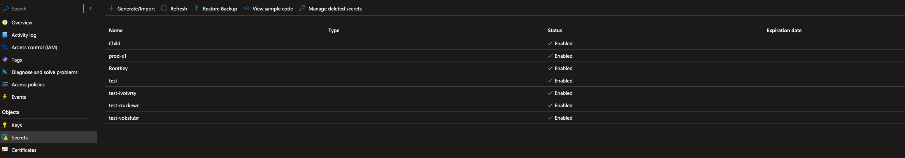
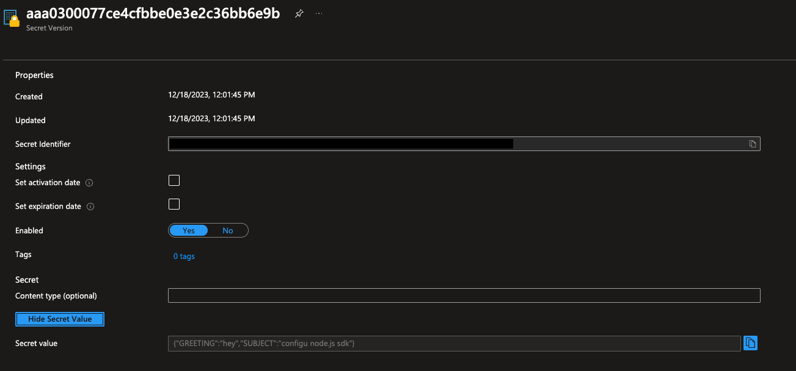

Integrates the Configu Orchestrator with Azure Key Vault.

## Initialization

Configu needs to be authorized to access Azure Key Vault. This can be done using the [default azure credentials](https://www.npmjs.com/package/@azure/identity#defaultazurecredential) which by default will read account information specified via [environment variables](https://www.npmjs.com/package/@azure/identity#environment-variables) and use it to authenticate. The `vaultUrl` parameter must always be provided.

The examples below will use the following environment variables for authentication: `AZURE_CLIENT_ID`, `AZURE_CLIENT_SECRET`, `AZURE_TENANT_ID` in conjunction with the required `vaultUrl` parameter.

example .configu file store configuration:

```json
{
  "stores": {
    "azure-key-vault-store": {
      "type": "azure-key-vault",
      "configuration": {
        "credential": {},
        "vaultUrl": "https://example.vault.azure.net"
      }
    }
  }
}
```

## Limitations

<Admonition type="info">

- Deleted configs does not immediately remove secrets [due to soft deletion](https://learn.microsoft.com/en-us/azure/key-vault/general/soft-delete-overview). Attempting to upsert to a deleted secret that is not purged will throw an error.

</Admonition>

## SDK Usage

<CodeTabs labels={["Node SDK", "Python SDK"]}>

```js
import path from 'path';
import fs from 'fs/promises';
import {
  AzureKeyVaultConfigStore,
  ConfigSet,
  ConfigSchema,
  UpsertCommand,
  EvalCommand,
  ExportCommand,
  TestCommand,
  DeleteCommand,
} from '@configu/node';

(async () => {
  try {
    const store = new AzureKeyVaultConfigStore({
      credential: {},
      vaultUrl: 'https://example.vault.azure.net',
    });
    const set = new ConfigSet('test');
    const absolutePath = path.resolve(path.join(__dirname, 'get-started.cfgu.json'));
    const fileContent = await fs.readFile(absolutePath, { encoding: 'utf8' });
    const schemaContents = JSON.parse(fileContent);
    const schema = new ConfigSchema('get-started', schemaContents);

    await new TestCommand({ store, clean: true }).run();

    await new UpsertCommand({
      store,
      set,
      schema,
      configs: {
        GREETING: 'hey',
        SUBJECT: 'configu node.js sdk',
      },
    }).run();

    const data = await new EvalCommand({
      store,
      set,
      schema,
    }).run();

    const configurationData = await new ExportCommand({
      pipe: data,
    }).run();

    console.log(configurationData);

    await new DeleteCommand({ store, set, schema }).run();
  } catch (error) {
    console.error(error);
  }
})();
```

```python
coming soon
```

</CodeTabs>

## CLI Usage

### Test command

```bash
configu test --store "azure-key-vault-store" --clean
```

### Upsert command

```bash
configu upsert --store "azure-key-vault-store" --set "test" --schema "./get-started.cfgu.json" \
    -c "GREETING=hey" \
    -c "SUBJECT=configu node.js sdk"
```

### Eval and export commands

```bash
configu eval --store "azure-key-vault-store" --set "test" --schema "./get-started.cfgu.json" \
 | configu export
```

Export result:

```json
{
  "GREETING": "hey",
  "SUBJECT": "configu node.js sdk",
  "MESSAGE": "hey, configu node.js sdk!"
}
```

### Delete command

Clean up the previous upsert by using:

```bash
configu delete --store "azure-key-vault-store" --set "test" --schema "./get-started.cfgu.json"
```

## Examples

Secrets list:


Upserted values to the `test` config set:

