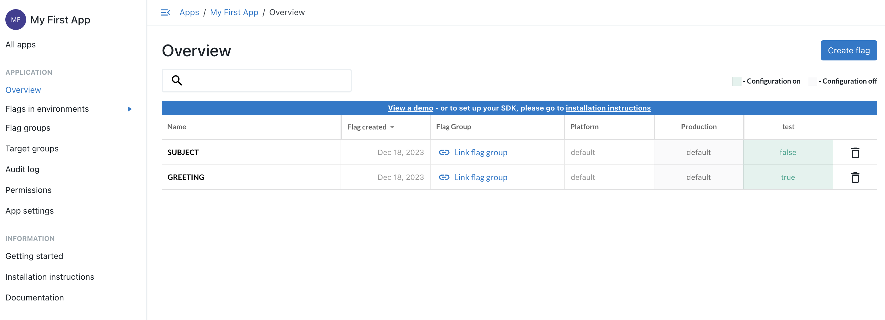

Integrates the Configu Orchestrator with CloudBees.

## Initialization

Configu needs to be authorized to access your CloudBees app. You must specify an `appKey` that corresponds to an an environment of some CloudBees environment and an optional context that has a `targetingKey` that identifies the subject (end-user, or client service) of a flag evaluation. You may also configure [`providerOptions`](https://github.com/DefinitelyTyped/DefinitelyTyped/blob/dc3f51b89bf7741b8d327311321ab6db041aa88d/types/rox-node/index.d.ts#L35C35-L35C35) to customize the CloudBees client.

Example .configu file store configuration for CLI usage:

```json
{
  "stores": {
    "cloud-bees-store": {
      "type": "cloud-bees",
      "configuration": {
        "appKey": "example-appKey"
      }
    }
  }
}
```

## Limitations

<Admonition type="info">

- Only supports the eval and export commands

</Admonition>

## SDK Usage

<CodeTabs labels={["Node SDK", "Python SDK"]}>

```js
import path from 'path';
import fs from 'fs/promises';
import {
  CloudBeesConfigStore,
  ConfigSet,
  ConfigSchema,
  UpsertCommand,
  EvalCommand,
  ExportCommand,
  TestCommand,
  DeleteCommand,
} from '@configu/node';

(async () => {
  try {
    const store = new CloudBeesConfigStore({
      appKey: 'example-appKey',
    });
    const set = new ConfigSet('test');
    const absolutePath = path.resolve(path.join(__dirname, 'get-started.cfgu.json'));
    const fileContent = await fs.readFile(absolutePath, { encoding: 'utf8' });
    const schemaContents = JSON.parse(fileContent);
    const schema = new ConfigSchema('get-started', schemaContents);

    const data = await new EvalCommand({
      store,
      set,
      schema,
    }).run();

    const configurationData = await new ExportCommand({
      pipe: data,
    }).run();

    console.log(configurationData);
  } catch (error) {
    console.error(error);
  }
})();
```

```python
coming soon
```

</CodeTabs>

## CLI Usage

### Test command

Not supported

### Upsert command

Not supported

### Eval and export commands

```bash
configu eval --store "cloud-bees-store" --set "test" --schema "./get-started.cfgu.json" \
 | configu export
```

Export result:

```json
{
  "GREETING": "hey",
  "SUBJECT": "configu node.js sdk",
  "MESSAGE": "hey, configu node.js sdk!"
}
```

### Delete command

Not supported

## Examples

Secrets list:

