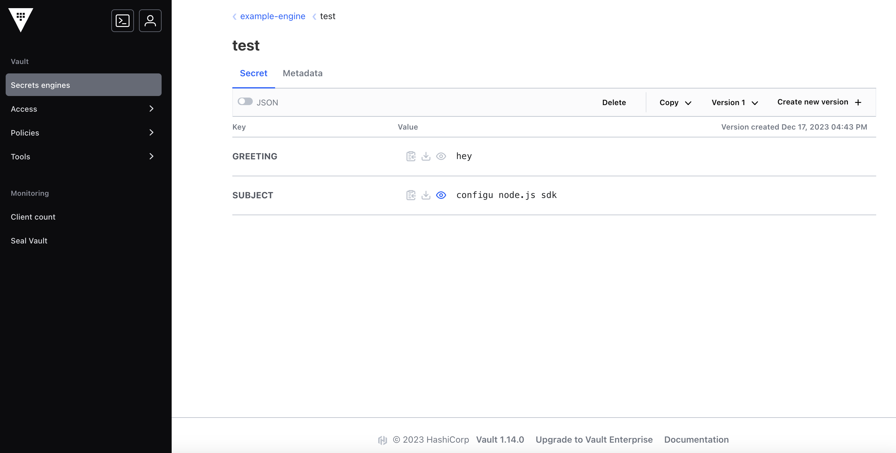

Integrates the Configu Orchestrator with HashiCorp Vault.

## Limitations

<Admonition type="info">

- Only supports the eval command

</Admonition>

## SDK Usage

<CodeTabs labels={["Node SDK", "Python SDK"]}>

```js
import path from 'path';
import fs from 'fs/promises';
import {
  LaunchDarklyConfigStore,
  ConfigSet,
  ConfigSchema,
  UpsertCommand,
  EvalCommand,
  ExportCommand,
  TestCommand,
  DeleteCommand,
} from '@configu/node';

(async () => {
  try {
    const store = new LaunchDarklyConfigStore({
      address: 'https://vault.example.com'
      engine: 'example-engine',
      token: 'example-token',
    });
    const set = new ConfigSet('test');
    const absolutePath = path.resolve(path.join(__dirname, 'get-started.cfgu.json'));
    const fileContent = await fs.readFile(absolutePath, { encoding: 'utf8' });
    const schemaContents = JSON.parse(fileContent);
    const schema = new ConfigSchema('get-started', schemaContents);

    const data = await new EvalCommand({
      store,
      set,
      schema,
    }).run();

    const configurationData = await new ExportCommand({
      pipe: data,
    }).run();

    console.log(configurationData);
  } catch (error) {
    console.error(error);
  }
})();
```

```python
coming soon
```

</CodeTabs>

## CLI Usage

Configu's CLI needs to be authorized to access your HashiCorp vault account. This can be done two ways

- By default, Configu's CLI attempts to use the following environment variables for the vault address and token: `VAULT_ADDR`, `VAULT_TOKEN`. You have to provide the engine via the [.configu file](../cli-config).
- via the [.configu file](../cli-config).

example .configu file:

```json
{
  "stores": {
    "launch-darkly-store": {
      "type": "launch-darkly",
      "configuration": {
        "address": "https://vault.example.com",
        "engine": "example-engine",
        "token": "example-token"
      }
    }
  }
}
```

### Test command

```bash
configu test --store "launch-darkly-store" --clean
```

### Upsert command

```bash
configu upsert --store "launch-darkly-store" --set "test" --schema "./get-started.cfgu.json" \
    -c "GREETING=hey" \
    -c "SUBJECT=configu node.js sdk"
```

### Eval and export commands

```bash
configu eval --store "launch-darkly-store" --set "test" --schema "./get-started.cfgu.json" \
 | configu export
```

Export result:

```json
{
  "GREETING": "hey",
  "SUBJECT": "configu node.js sdk",
  "MESSAGE": "hey, configu node.js sdk!"
}
```

### Delete command

Clean up the previous upsert by using:

```bash
configu delete --store "launch-darkly-store" --set "test" --schema "./get-started.cfgu.json"
```

## Examples

Secrets list:


Upserted values to the `test` config set:

