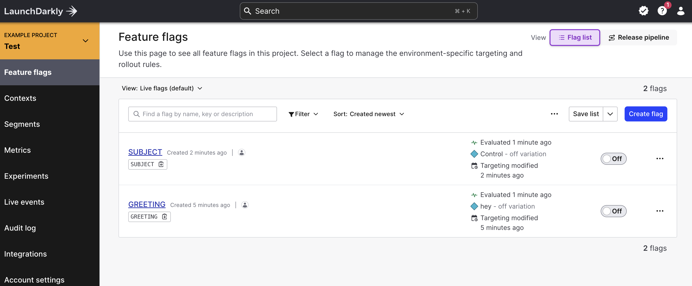

Integrates the Configu Orchestrator with LaunchDarkly.

## Initialization

Configu needs to be authorized to access your LaunchDarkly project. You must specify an `sdkKey` that corresponds to an SDK key of an environment of some LaunchDarkly project and a context that has a `key` or a `targetingKey` that identifies the subject (end-user, or client service) of a flag evaluation. You may also configure [`ldOptions`](https://launchdarkly.github.io/node-server-sdk/interfaces/_launchdarkly_node_server_sdk_.LDOptions.html) to customize the LaunchDarkly client.

example .configu file store configuration:

```json
{
  "stores": {
    "launch-darkly-store": {
      "type": "launch-darkly",
      "configuration": {
        "sdkKey": "example-sdkKey",
        "context": { "targetingKey": "default" }
      }
    }
  }
}
```

## Limitations

<Admonition type="info">

- Only supports the eval and export commands

</Admonition>

## SDK Usage

<CodeTabs labels={["Node SDK", "Python SDK"]}>

```js
import path from 'path';
import fs from 'fs/promises';
import {
  LaunchDarklyConfigStore,
  ConfigSet,
  ConfigSchema,
  UpsertCommand,
  EvalCommand,
  ExportCommand,
  TestCommand,
  DeleteCommand,
} from '@configu/node';

(async () => {
  try {
    const store = new LaunchDarklyConfigStore({
      sdkKey: 'example-sdkKey',
      context: { targetingKey: 'default' },
    });
    const set = new ConfigSet('test');
    const absolutePath = path.resolve(path.join(__dirname, 'get-started.cfgu.json'));
    const fileContent = await fs.readFile(absolutePath, { encoding: 'utf8' });
    const schemaContents = JSON.parse(fileContent);
    const schema = new ConfigSchema('get-started', schemaContents);

    const data = await new EvalCommand({
      store,
      set,
      schema,
    }).run();

    const configurationData = await new ExportCommand({
      pipe: data,
    }).run();

    console.log(configurationData);
  } catch (error) {
    console.error(error);
  }
})();
```

```python
coming soon
```

</CodeTabs>

## CLI Usage

### Test command

Not supported

### Upsert command

Not supported

### Eval and export commands

```bash
configu eval --store "launch-darkly-store" --set "test" --schema "./get-started.cfgu.json" \
 | configu export
```

Export result:

```json
{
  "GREETING": "hey",
  "SUBJECT": "configu node.js sdk",
  "MESSAGE": "hey, configu node.js sdk!"
}
```

### Delete command

Not supported

## Examples

Secrets list:

