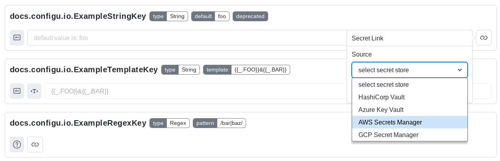
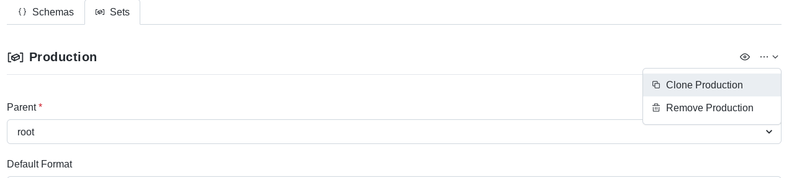

Sets are where you initialize values for your schema keys, you can have unlimited number of sets.
The 'sets' are organized in a tree structure, starting from the root (`/`) set, and enable inheritance 
system, to reduce copying of values again and again.

A Set most likely represents an environment or an instance of a service/application. They enable easy 
separation and management of values between those different environments.

When Configu exports a set, **all** keys will be exported, keys without a value (haven't been assigned 
or inherited values or have default values) will be exported with empty value.

## Defining A Set

To define a new set, you can easily use the `upsert` command

```sh
configu upsert \
[--store "store-name | store-uri"] # uses "default" store by default
--set "/set-name" --schema "./schema-name.cfgu.json" \
[--config "key1=value"]
[--import] # import the value from an existing configuration file 
[--interactive] # with Configu store, this will open the set form interactively and simply within the app
```

Give your set a meaningful name, and set its parent set (declare as a path /parent/set-name), 
as well as what the default export format for this set should be (only available on the app).

## Attaching A Secret From A Secret Manager

Configu supports fetching sensitive info from many popular [secret managers](/docs/store) if you provide 
it a token to fetch them at runtime. 

To link a value that's stored in a secret manager whitin the app, click the button to the right of the 
key in the set interactive editor as you define the set, choose the secret manager and provide the 
path for the key:




Or use the `upsert` command and link the value as an object referencing to another store 
[(read more about other stores)](/docs/cli)

```sh
configu upsert \
--set "/set-name" --schema "./schema-name.cfgu.json" \
--config "key1={type:'HashiCorpVault', path:'kv/prod/some-secret'}"
```

## Cloning A Set

Cloning a set lets you make an exact copy of it with a new name.

To clone a set, navigate to **Sets** and click on the set you want to clone. To the right, 
click on the ellipsis menu and select "Clone".




## Deleting A Set

<Admonition type="warning">
Deleting A Set Is Irreversible!

If you delete a set there's no way to restore it other than re-creating it.

</Admonition>

To delete a set, navigate to **Sets** and click on the set you want to delete. To the right, 
click on the elipsis menu and select "Delete".


Or use the `delete` command

```sh
configu delete --set "/development/local-set"
```