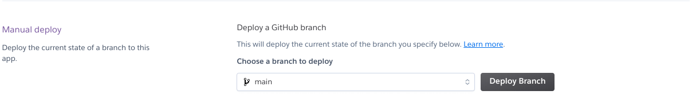
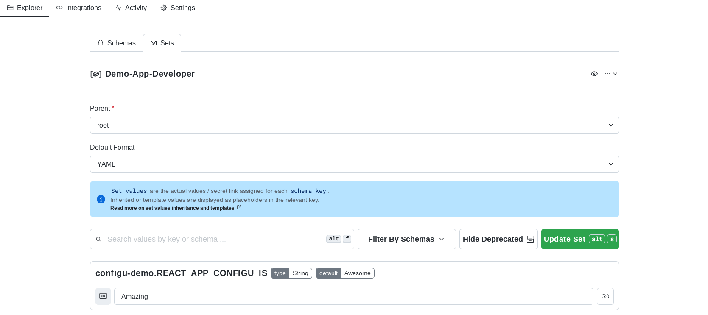

Today's developer teams are tasked with having to manage Config Ops on the _platform_ as well,
and Heroku is a great opportunity to show how Configu lets you only worry about your config 
[schemas](/docs/schemas), with Configu providing the rest of what's needed, including talking 
to Heroku's API to get your new config values in place. Check out the tutorial below

In order to complete the tutorial, you'll need Heroku account, Git, Configu account,
and a simple hello world app to deploy which we've provided in this repo. Let's go!

<pre style={{ width: '100%' }}>
  <center>
    <br />
    <br />
    <br />
    <br />
    <br />
    <br />
    <br />
    Video Coming Soon
    <br />
    <br />
    <br />
    <br />
    <br />
    <br />
    <br />
  </center>
</pre>

## Step 1 - Deploy Our Demo App To Heroku

We've created a [demo echo application](https://github.com/) based on the default React 
Application Hello World for you to be able to interact with using Configu; you'll deploy 
a config change that causes the text to display differently.

First, fork the demo echo application repo on Github, then create a new personal application 
at Heroku. Select the option to deploy from Github, and point it at the fork of the echo application 
(see the [Heroku docs on how to deploy](https://heroku.com)).

Next, reveal the configuration variables found at **Personal** >> **your-app-name** >> **Settings**:


While the app ships with a `.env` file so you see something when it's deployed, 
Heroku doesn't automatically set this up as a _project_ config variable when 
it figures out how to build everything.

Next, we need to make note of our personal token in order to have Configu pass it along when it needs to make API requests
on our behalf. You can export this token to your local environment and access it from the command line with
a shell variable. In Heroku, we go to **Account Settings** from the top right to get to our token:


By default, Heroku won't automatically deploy the default branch on change; you can set that up if you wish, but for our purposes 
we'll just deploy it once, manually from **App** &rarr; **Deploy**:



If you're using the free tier, be aware that it can take a few seconds for apps to "wake up" and serve requests. Once you can reach the app and you see the Configu
logo spinning around you're ready to move on to the next step. 

## Step 2 - Create A Test Organization & Push The Example Schema

First, follow our [administration guide](/docs/administration) for managing organizations to create a new, temporary
organization named `configu-tutorial` or similar

Once you've logged in with the CLI via `configu login` and selected the `configu-tutorial` organization,
you can navigate to the location where you want to clone the echo application repo that you previously forked.

Navigate to the repo, then check out `config/configu-demo-app.cfgu`:

```json
{
    "REACT_APP_CONFIGU_IS": {
        "type": "String",
        "default": "Awesome"
    }
}
```
This is all we need in order to be able to change the text on the demo application, so let's push it via `configu push`,
which is how we sync all `.cfgu` files in the current directory with Configu.

It should finish very quickly, at which point you'll see the schema appear in the web application:


Now we're ready to create sets!

## Step 3 - Create Two Sets To Implement The Schema

Most applications have **at least** two contexts in which to run: production and development. In this tutorial, we're
changing a line of text - but it could very easily be much more complicated than that.

To create a new set in the web application, navigate to **Explorer** &rarr; **Sets** and click on the green "New Set" 
button. 


In the first set, we're just going to leave everything default. We've created the one environment variable that needs
to be set, and Configu will assign it the default value of "Awesome" if we don't supply anything else. More information
about types can be found in our [in depth guide to types](/docs/types) which also links to schemas.

For the second set, we'll repeat what we just did, but we'll assign a value of "Amazing" instead of letting the default
value be filled automatically:



Now, we're going to export our configuration for local dev, and changing the instance we've already deployed to Heroku.

## Step 4 - Experiment With Switching Between Sets

First, let's use Configu to tell Heroku that we need to change our app's configuration based on the alternative set
that we just finished saving.


To build our command we select the schema we just created, the "awesome" set, and Heroku as our platform. When you paste
the command, you will just replace it with the shell variable we created earlier.

```shell
configu export \
    --schema "configu-demo" --set "demo-app-developer" \
    --runtime "Heroku" --heroku-app-uid "your-heroku-app-id" --heroku-token $HEROKU_TOKEN

```

When you run this, you can now check your browser and once you refresh it, the value has changed and Configu is now
Amazing.

Next, we export our local config (in this case we're simply over-writing the `.env` file that shipped
with the demo). We go back to the command builder, and for our purposes select "print" as the mode instead of "sync",
and we get a command like this:

```
configu export \
    --schema "demo-heroku" --set "demo-app-amazing" \
    --format "Dotenv"
```
We can switch between sets however we like, wherever we like: headless or in local dev, on a build server or CI server, or through 
any other automation framework.

<Admonition type="note">
Would you like to dive deeper?

Are you enjoying this tutorial and want to poke around a little more? There are other files in `config/` that are simple
enough that you could write a schema for and have Configu export for you in JSON or in some cases YAML format based on
sets that you define, just like in the first part of the demo.

</Admonition>

For now, you're done! This was a simple operation, but that's the best way to show someone the power of Configu's safety
and automation and what it could mean for your development loop. 

## Conclusion

Local, development, r&d - all of these are as easy to switch between as turning a dial with absolute safety and 
security.

<Admonition type="warning">
Configu Never Stores Your Tokens

Configu requires that tokens to third-party infrastructure providers and secret managers be provided at runtime, so
that our platform can pass them blindly to the service that requires them in order for your command to complete 
successfully.
Configu doesn't store or passthrough those tokens at any time.

</Admonition>
